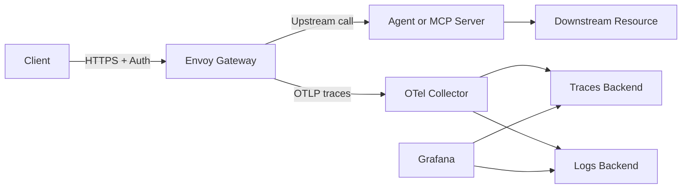

```mermaid
flowchart LR
    C[Client]
    EG[Envoy Gateway]
    A1[Agent or MCP Server]
    R1[Downstream Resource]
    OC[OTel Collector]
    TB[Traces Backend]
    LB[Logs Backend ]
    G[Grafana]

    C -->|HTTPS + Auth| EG
    EG -->|Upstream call| A1
    A1 --> R1

    EG -->|OTLP traces| OC
    OC --> TB
    OC --> LB
    G --> TB
    G --> LB
```