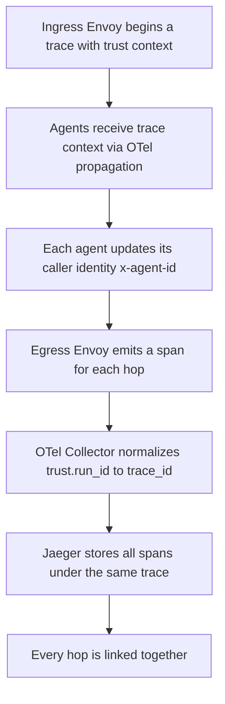

# Trust Graph with OTel

Distributed Trust-Context Aware Tracing for Agents, MCP Services, and Resources

1. Overview

    Trust Graph with OTel is a tracing-based approach to reconstructing the end-to-end chain of responsibility in agent-driven systems:

    ```bash
    Principal → Agent → Resource
    ```

    This is achieved without app instrumentation, using only:
    - Ingress Envoy Gateway
    - Egress Envoy Gateway
    - OpenTelemetry Collector
    - Jaeger
    - Grafana

    Each hop emits spans enriched with trust context, enabling lineage, provenance, and policy insights for AI agents, MCP services, microservices, or backend APIs.

2. Problem Statement

    Modern distributed agent ecosystems require:

    - End-to-end provenance
    - Identity propagation
    - Purpose-aware and policy-aware execution context
    - Visibility into cross-agent, cross-service, and  cross-resource graph paths
    - Traditional tracing provides timing, not trust semantics.

    We need tracing to answer:

    - Who initiated the request?
    - Which agent acted on behalf of whom?
    - What resources were accessed under which identity?
    - What path did the request take through the system?
    - Trust Graph with OTel provides this.

3. MVP Architecture (Option C Hybrid)

    This MVP provides:

    - Principal → Agent tracing via Ingress Envoy
    - Agent → Resource tracing via Egress Envoy
    - Trust context tracked via span attributes (trust.*)
    - Full lineage available via Jaeger + Grafana


4. Architecture

```mermaid
flowchart LR

  %% =======================
  %% Ingress gateway
  %% =======================
  subgraph IngressNS["Namespace: ingress-gateway"]
    C[Principal or Client]

    IG[Envoy ingress gateway
auth and policy
adds trust headers
adds trust span attributes]
  end

  %% =======================
  %% Workloads and resources
  %% =======================
  subgraph WorkloadsNS["Namespace: workloads"]
    A[Agent or MCP server]
    R[Resource service
api or database]
  end

  %% =======================
  %% Egress gateway
  %% =======================
  subgraph EgressNS["Namespace: egress-gateway"]
    EG[Envoy egress gateway
fronts resources
adds trust span attributes]
  end

  %% =======================
  %% Observability
  %% =======================
  subgraph ObsNS["Namespace: observability"]
    OC[OpenTelemetry Collector
otlp receiver
batch and attributes processors]

    JB[Jaeger backend
traces storage and query]

    G[Grafana dashboards
trust graph views]
  end

  %% ===========
  %% Principal -> Agent hops (solid)
  %% ===========
  C -->|principal to agent hop
https request with authentication| IG
  IG -->|principal to agent hop
upstream call
trust headers applied| A

  IG -->|otlp traces
trust principal id
trust agent id
trust target agent
trust decision
trust run id| OC

  %% ====================
  %% Agent -> Resource hops (dashed)
  %% ====================
  A -.->|agent to resource hop
http or grpc call
via egress gateway| EG
  EG -.->|agent to resource hop
call to resource
propagate trace context
and trust headers| R

  EG -.->|otlp traces
trust agent id
trust target resource
trust run id| OC

  %% ===========
  %% Observability
  %% ===========
  OC --> JB
  G --> JB

  %% ====================
  %% Styles
  %% ====================
  classDef base fill:#e8f3ff,stroke:#1b4f72,stroke-width:1px;
  classDef extended fill:#fff4e5,stroke:#ef6c00,stroke-width:1px,stroke-dasharray:5 3;
  classDef obs fill:#e9f7ef,stroke:#1e8449,stroke-width:1px;

  class C,IG,A base;
  class EG,R extended;
  class OC,JB,G obs;

```


5. Trust Attribute Schema

    All spans carry the following:

    | Attribute             | Meaning                    |
    | --------------------- | -------------------------- |
    | `trust.run_id`        | Stable trust lineage ID    |
    | `trust.principal_id`  | End-user, system, or identity that initiated the request    |
    | `trust.agent_id`      | Logical agent or MCP server handling the hop     |
    | `trust.target`        | Upstream target (agent or resource)    |
    | `trust.decision`      | Allow / deny from the gateway    |


6. Ingress Envoy Responsibilities

    - Authenticate request
    - Authorize request
    - Normalize identity → trust headers
    - Add `trust.*` span attributes
    - Export spans via OTLP to Collector

7. Egress Envoy Responsibilities

    - Capture agent outbound calls
    - Forward trust headers and trace context
    - Add `trust.*` span attributes for resource access
    - Export spans

8. OTel Collector Responsibilities

    - Receive OTLP traces from both Envoys
    - Ensure `trust.run_id` = `trace_id` (attributes processor)
    - Batch, normalize, export to Jaeger

## How is Trust Graph lineage established?

